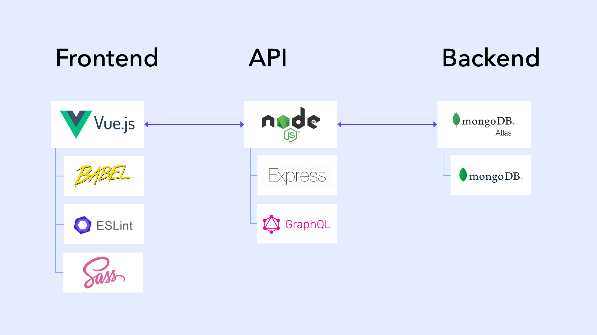
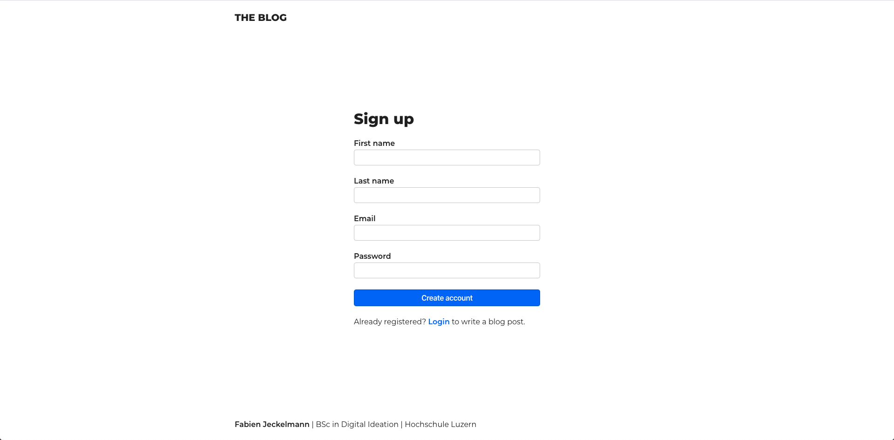
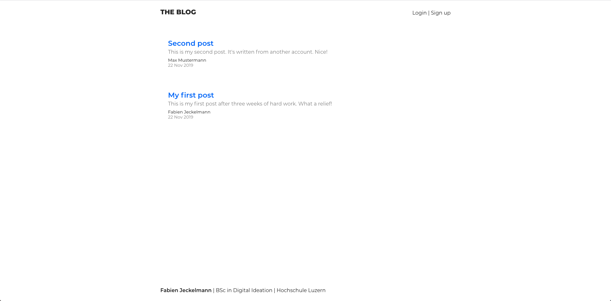
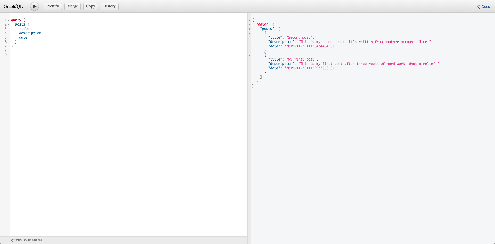
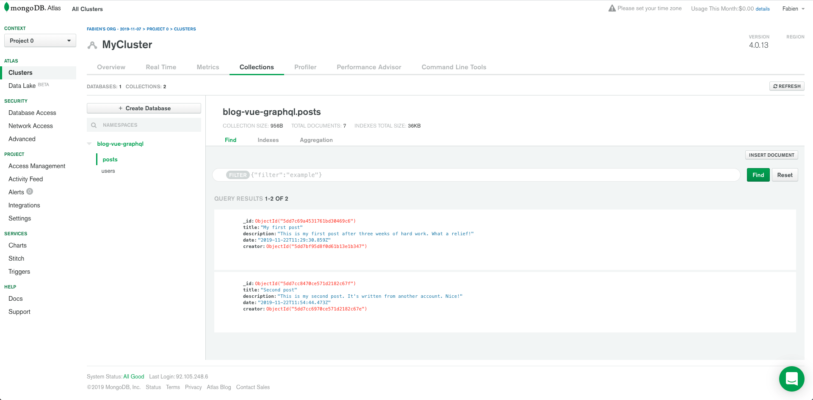

# vue-graphql-mongodb-blog #

First steps with vanilla GraphQL, MongoDB and JWT...

## Usage ##

### Frontend ##

```bash
# Start Vue frontend (localhost:8080)
npm run serve
```

### API ###

```bash
# Start GraphQL-Server (localhost:3000)
npm run start
```

### Backend ###

Create nodemon.json to save your credentials for MongoDB

```json
 {
   "env": {
     "MONGO_USER": "<username>",
     "MONGO_PASSWORD": "<password>",
     "MONGO_DB": "<db>"
   }
 }
```

## Architecture ##

### Tech stack ###



### Links ###

[`VueJS`](https://vuejs.org/) - SPA Framework

[`bcrypt`](https://github.com/dcodeIO/bcrypt.js/) - Security/Hashing

[`JWT`](https://jwt.io/) - Authentication & Authorization

[`ExpressJS`](https://expressjs.com/) - API-Server

[`GraphQL`](https://graphql.org/) - Query Language

[`mongoDB`](https://www.mongodb.com/) - Database

[`Atlas`](https://www.mongodb.com/cloud/atlas) - Database Hosting

## Documentation ##

### Context ###

This project was developed within the scope of the study modul "Mentoring Programming" as part of my BSc degree in Digital Ideation. After confirmation of my project proposal by the supervising professor I was able to start with its realisation. For three weeks worth of work (distributed over four weeks) I had the opportunity to autonomously achieve the project goals.

### Objective ###

The main objective of this project was to familiarise with the API query language GrapQL and MongoDB databases without relying on frameworks. In order to be able to present an appealing end product the technology stack was extended with an VueJS frontend. Over the course of the project I decided to implement – in addition to the fixed requirements - an authentification module based on "JWT" (Json Web Token).

### Approach ###

Since I was taking my first steps with technologies like GraphQl and MongoDB I was heavily reliant on the documentations provided by the developers and tutorials found on the web. The in-browser GraphQL-IDE GraphiQL helped me a lot and provided an ideal introduction to the topic. It also enabled me to add the database and frontend step by step, which allowed me to focus on one section at a time and also resulted in easier debugging. My pre-existing experiences with VueJS proved to be very valuable, when connecting the application to the API.

#### Helpful resources ####

[`How to GraphQL`](https://www.howtographql.com/) - GraphQL-Tutorial with NodeJS

[`Medium`](https://medium.com/quick-code/handling-authentication-and-authorization-with-node-7f9548fedde8) - Article with multiple code snippets about authentication and authorization with Node

[`Youtube`](https://www.youtube.com/playlist?list=PL55RiY5tL51rG1x02Yyj93iypUuHYXcB_) - Tutorial series building a complete project with Node, MongoDB and React.

### Result ###

The final product is a blog, where only signed in users can publish content.

#### The blog's sign up view ####



#### The blog's posts view ####



#### The GraphiQL interface ####



#### The MongoDB database ####



### Learnings ###

Firstly I was able to experience first hand the advantages that GraphQL has over REST:

* Easier development thanks to GraphiQL.

* Schema and type system improve API quality and help avoiding errors.

* High flexibility on the frontend due to the exposure of only a single endpoint.

* No overfetching, resulting in better overall performance.

And secondly the usage of vanilla code allowed me to encounter the limitations of the different technologies, giving me a better understanding of the benefits that frameworks like for example Apollo-GraphQL could provide.

## License ##

[MIT](https://choosealicense.com/licenses/mit/)
